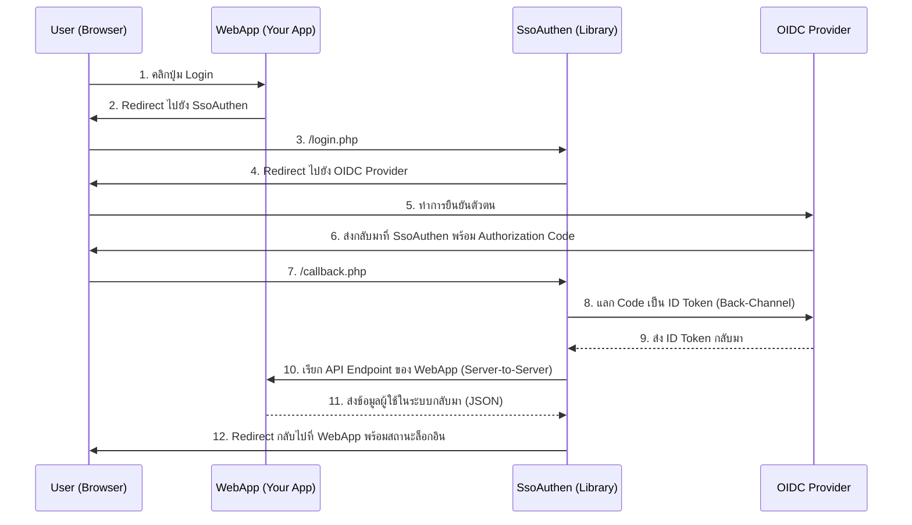

# **คู่มือการติดตั้งและใช้งาน sso-authen Library (v2)**

`sso-authen` เป็นไลบรารี PHP สำหรับเชื่อมต่อเว็บแอปพลิเคชันเข้ากับผู้ให้บริการยืนยันตัวตน (Identity Provider) ที่ใช้มาตรฐาน OpenID Connect (OIDC) ถูกออกแบบมาให้มีความยืดหยุ่นสูง สามารถรองรับผู้ให้บริการได้หลายราย (Multi-Provider) และมีสถาปัตยกรรมที่ทันสมัยซึ่ง **ไม่ผูกมัดกับเทคโนโลยีฝั่ง Backend** ของผู้ใช้งาน

---

## ✨ คุณสมบัติ (Features)

* **Technology Agnostic:** สื่อสารกับเว็บแอปพลิเคชันของคุณผ่าน **API Endpoint** ทำให้สามารถทำงานร่วมกับ Backend ที่เขียนด้วยภาษาใดก็ได้ (Node.js, Python, Ruby, Java, etc.)
* **Modern PHP:** พัฒนาบนพื้นฐานของ PHP 7.0+ และจัดการ Dependencies ทั้งหมดผ่าน Composer
* **Clean Architecture:** ใช้สถาปัตยกรรมเชิงวัตถุ (OOP) โดยมี `SsoHandler` เป็นคลาสหลักในการทำงาน
* **Multi-Provider Support:** รองรับการเชื่อมต่อกับผู้ให้บริการ OIDC หลายรายผ่านระบบคอนฟิกที่ยืดหยุ่น
* **Data Normalization:** มีระบบแปลงข้อมูล (Claim Mapping) เพื่อให้แอปพลิเคชันได้รับข้อมูลผู้ใช้ในรูปแบบมาตรฐานเดียวกันเสมอ ไม่ว่าจะล็อกอินมาจากที่ใด
* **Decoupled:** แยกส่วนของไลบรารี (Authentication) ออกจากตรรกะของแอปพลิเคชัน (Authorization) อย่างชัดเจนผ่าน **API Contract**
* **User-Friendly Feedback:** มีระบบแสดงผลข้อความโต้ตอบที่สวยงามด้วย SweetAlert2

---

## 📋 ข้อกำหนด (Requirements)

* * **สำหรับ `sso-authen` Library:**
    * Web Server ที่รัน PHP 7.0+ ได้ (เช่น Apache, Nginx)
    * Composer
    * PHP Extensions: cURL, JSON
* **สำหรับเว็บแอปพลิเคชันของคุณ:**
    * สามารถสร้าง API Endpoint ที่รับ HTTP POST request ได้
    * Credentials (`Client ID` และ `Client Secret`) ที่ได้รับจากการลงทะเบียนแอปพลิเคชันกับผู้ให้บริการ OIDC

---

## 📁 โครงสร้างไฟล์ (Files Structure)

โปรเจกต์ที่นำไลบรารีนี้ไปใช้ ควรมีโครงสร้างโดยรวมดังนี้:

```text
/your-webapp/                      <-- โฟลเดอร์หลักของเว็บแอปพลิเคชัน
|
|-- sso-authen/                     <-- โฟลเดอร์ของไลบรารี
|   |-- config/
|   |   |-- config.php
|   |   `-- providers/
|   |       `-- psu.php
|   |-- public/
|   |   |-- callback.php
|   |   |-- login.php
|   |   |-- logout.php
|   |   |-- helpers.php
|   |   `-- templates/
|   |       `-- layout.php
|   `-- src/
|       `-- SsoHandler.php
|
|-- vendor/                         (สร้างโดย Composer)
|-- composer.json
|-- db_config.php                   (ไฟล์ตั้งค่า DB ของแอป)
|-- user_handler.php                (ไฟล์จัดการผู้ใช้ของเว็บแอปใน v.1)
|-- api/user-handler.php            (ไฟล์จัดการผู้ใช้ของเว็บแอปใน v.2)
`-- index.php                       (และไฟล์อื่นๆ ของแอป)
```

---

## ⚙️ หลักการทำงาน (How it Works)

`sso-authen` ทำหน้าที่เป็น **"สะพาน"** ระหว่างเว็บแอปพลิเคชันของคุณกับ SSO Provider โดยกระบวนการทั้งหมดจะเกิดขึ้นผ่านการ Redirect และการสื่อสารแบบ Server-to-Server ที่ปลอดภัย

**แผนภาพการทำงาน:**



---

## 🚀 การติดตั้งและตั้งค่า (Installation & Configuration)

### 1. ติดตั้งไลบรารี

วางโฟลเดอร์ `sso-authen` บน Web Server ที่รัน PHP ได้ จากนั้นใน Terminal ให้เข้าไปที่ไดเรกทอรี `sso-authen` แล้วรันคำสั่ง:

```bash
composer install
```

### 2. ตั้งค่า `config.php`

เปิดไฟล์ `sso-authen/config/config.php` และกำหนดค่าที่สำคัญ 3 ส่วน:

```php
// sso-authen/config/config.php

// 1. เลือกว่าจะใช้ Provider ไหน (ชื่อต้องตรงกับไฟล์ใน providers/)
$activeProvider = 'psu'; 

// 2. กำหนด URL ของ API Endpoint ในเว็บแอปพลิเคชันของคุณ
define('USER_HANDLER_ENDPOINT', '[https://yourapp.com/api/sso-user-handler](https://yourapp.com/api/sso-user-handler)');

// 3. ตั้งค่า Secret Key สำหรับยืนยันตัวตนระหว่างสองระบบ
define('API_SECRET_KEY', 'YOUR_VERY_STRONG_AND_RANDOM_SECRET_KEY');
```

### 3. เพิ่ม Provider ใหม่ (ถ้าจำเป็น)

หากต้องการเชื่อมต่อกับผู้ให้บริการรายใหม่ (เช่น มหาวิทยาลัยอื่น) ให้สร้างไฟล์คอนฟิกสำหรับผู้ให้บริการแต่ละรายใน `sso-authen/config/providers/` โดยใช้ psu.php เป็นต้นแบบ และแก้ไขค่า `clientID`, `clientSecret`, `providerURL`, `redirectUri`, `scopes`, และ `claim_mapping` ให้ถูกต้อง 

ตัวอย่าง **psu.php**:

```php
<?php
// sso-authen/config/providers/psu.php
return [
    'clientID'     => 'YOUR_PSU_CLIENT_ID_HERE',
    'clientSecret' => 'YOUR_PSU_CLIENT_SECRET_HERE',
    'providerURL'  => '[https://psusso.psu.ac.th/](https://psusso.psu.ac.th/)...',
    'redirectUri'  => '[http://your-app.test/sso-authen/public/callback.php](http://your-app.test/sso-authen/public/callback.php)', 
    'scopes'       => ['openid', 'profile', 'email', 'psu_profile'],
    'claim_mapping' => [
        'id'        => 'psu_id',
        'username'  => 'preferred_username',
        'name'      => 'display_name_th',
        'email'     => 'email',
        // ... map fields as needed ...
    ]
];
```

---

## 🔌 คู่มือการเชื่อมต่อสำหรับเว็บแอปพลิเคชัน (Integration Guide)

นี่คือขั้นตอนสำหรับนักพัฒนาเว็บแอปพลิเคชัน (เช่น Node.js, PHP, Python) ที่ต้องการเชื่อมต่อกับ `sso-authen`

### ขั้นตอนที่ 1: สร้าง API Endpoint สำหรับจัดการผู้ใช้

ในเว็บแอปพลิเคชันของคุณ ให้สร้าง API Endpoint ที่สามารถรับ HTTP POST request ได้ โดย Endpoint นี้ต้องทำหน้าที่ 3 อย่าง:

1.  **ตรวจสอบ `X-API-SECRET` Header:** เพื่อให้แน่ใจว่า Request มาจากไลบรารี `sso-authen` จริง
2.  **รับข้อมูลผู้ใช้ (JSON Body):** รับข้อมูลผู้ใช้ที่ไลบรารีส่งมาให้
3.  **จัดการผู้ใช้และส่งข้อมูลกลับ (JSON Response):** ค้นหาหรือสร้างผู้ใช้ในฐานข้อมูลของคุณ แล้วส่งข้อมูลผู้ใช้ในระบบของคุณกลับไป

ดูรายละเอียดของ Request และ Response ที่คาดหวังได้ในหัวข้อ **API Contract** ด้านล่าง

**ตัวอย่าง API Endpoint ด้วย PHP:**

```php
<?php
// file: your-webapp/api/sso-user-handler.php

header('Content-Type: application/json');

// --- การตั้งค่าฝั่ง Web App ---
define('APP_API_SECRET_KEY', 'YOUR_VERY_STRONG_AND_RANDOM_SECRET_KEY'); // ต้องตรงกับใน config.php

// 1. ตรวจสอบความปลอดภัย
$apiKey = $_SERVER['HTTP_X_API_SECRET'] ?? '';
if ($apiKey !== APP_API_SECRET_KEY) {
    http_response_code(401);
    echo json_encode(['error' => 'Unauthorized']);
    exit;
}

// 2. รับข้อมูล
$json_payload = file_get_contents('php://input');
$data = json_decode($json_payload, true);
$normalizedUser = $data['normalizedUser'];

// 3. จัดการผู้ใช้ (ค้นหา/สร้าง/อัปเดต ใน DB ของคุณ)
// $internalUser = findOrCreateUserInYourDatabase($normalizedUser);
$internalUser = [
    'id' => 123, // ID จากฐานข้อมูลของคุณ
    'user_id' => $normalizedUser['id'],
    'email' => $normalizedUser['email'],
    'name' => $normalizedUser['name'],
    'role' => 'admin' // Role จากฐานข้อมูลของคุณ
];

// **สำคัญ:** ณ จุดนี้ คือจุดที่เว็บแอปของคุณต้องสร้าง Session หรือ JWT Token
// ของตัวเอง เพื่อให้ผู้ใช้ล็อกอินค้างในระบบของคุณต่อไป
// เช่น: $_SESSION['app_user'] = $internalUser;

// 4. ส่งข้อมูลกลับ
http_response_code(200);
echo json_encode($internalUser);
```

**ตัวอย่าง API Endpoint ด้วย Node.js (Express):**

```javascript
// file: your-webapp/routes/sso-handler.js

const express = require('express');
const router = express.Router();

// --- การตั้งค่าฝั่ง Web App ---
// แนะนำให้เก็บค่านี้ใน Environment Variables (.env)
const APP_API_SECRET_KEY = 'YOUR_VERY_STRONG_AND_RANDOM_SECRET_KEY'; // ต้องตรงกับใน config.php

router.post('/sso-user-handler', (req, res) => {
    // 1. ตรวจสอบความปลอดภัย
    const receivedKey = req.headers['x-api-secret'];
    if (receivedKey !== APP_API_SECRET_KEY) {
        return res.status(401).json({ error: 'Unauthorized' });
    }

    // 2. รับข้อมูล
    const { normalizedUser, ssoUserInfo } = req.body;

    if (!normalizedUser) {
        return res.status(400).json({ error: 'Invalid payload' });
    }

    // 3. จัดการผู้ใช้ (ค้นหา/สร้าง/อัปเดต ใน DB ของคุณ เช่น MongoDB, PostgreSQL)
    // const internalUser = await findOrCreateUserInMongo(normalizedUser);
    const internalUser = {
        id: '65f1a2b3c4d5e6f7a8b9c0d1', // ID จาก MongoDB ของคุณ
        user_id: normalizedUser.id,
        email: normalizedUser.email,
        name: normalizedUser.name,
        role: 'member' // Role จากฐานข้อมูลของคุณ
    };

    // **สำคัญ:** ณ จุดนี้ คือจุดที่เว็บแอปของคุณต้องสร้าง Session หรือ JWT Token
    // ของตัวเอง เพื่อให้ผู้ใช้ล็อกอินค้างในระบบของคุณต่อไป
    // เช่น: req.session.user = internalUser;
    // หรือ: const token = jwt.sign({ id: internalUser.id }, 'YOUR_JWT_SECRET');

    // 4. ส่งข้อมูลกลับ
    res.status(200).json(internalUser);
});

module.exports = router;
```

### ขั้นตอนที่ 2: สร้างลิงก์ Login / Logout

ในหน้าเว็บแอปพลิเคชันของคุณ ให้สร้างลิงก์ไปยังไฟล์ใน `sso-authen/public/`

* **Login:** ลิงก์ไปยัง `https://your-sso-server.com/sso-authen/public/login.php`
* **Logout:** ลิงก์ไปยัง `https://your-sso-server.com/sso-authen/public/logout.php`

### ขั้นตอนที่ 3: จัดการ Session และป้องกันหน้าเพจ

หลังจากที่ `sso-authen` ทำงานเสร็จและ Redirect ผู้ใช้กลับมายังเว็บแอปของคุณแล้ว **เป็นหน้าที่ของเว็บแอปพลิเคชันเองที่จะต้องจัดการ Session หรือ Token ของตัวเอง** เพื่อตรวจสอบสถานะการล็อกอินและป้องกันหน้าเพจที่ต้องการการยืนยันตัวตน

---

## 📜 API Contract

นี่คือข้อกำหนดของข้อมูลที่ `sso-authen` และเว็บแอปพลิเคชันของคุณใช้สื่อสารกัน

### Request: `sso-authen` → Web App

* **Method:** `POST`
* **Headers:**
    * `Content-Type: application/json`
    * `X-API-SECRET: {API_SECRET_KEY}`
* **Body (JSON):**

```json
{
  "normalizedUser": {
    "id": "user123",
    "username": "test.user",
    "name": "Test User",
    "firstName": "Test",
    "lastName": "User",
    "email": "test.u@example.com",
    "department": "IT Department"
  },
  "ssoUserInfo": {
    "sub": "user123",
    "preferred_username": "test.user",
    "name": "Test User",
    "email": "test.u@example.com",
    "...": "..."
  }
}
```

### Response: Web App → `sso-authen`

* **Status Code:** `200 OK`
* **Body (JSON):**

```json
{
  "id": 123,
  "user_id": "user123",
  "email": "test.u@example.com",
  "name": "Test User",
  "role": "admin"
}
```

**หมายเหตุ:** `role` เป็น Key ที่สำคัญ เนื่องจากไลบรารีอาจใช้ในการตัดสินใจ Redirect ผู้ใช้ไปยังหน้าต่างๆ หลังล็อกอินสำเร็จ

---

## 🔌 การตั้งค่าอื่น ๆ

### 1. ตั้งค่าการเชื่อมต่อฐานข้อมูล (สำหรับเว็บแอปพลิเคชัน ถ้ายังไม่มี)

สร้างไฟล์ `db_config.php` ใน root ของเว็บแอปพลิเคชัน เพื่อเก็บข้อมูลการเชื่อมต่อฐานข้อมูล

```php
<?php // db_config.php
define('DB_HOST', 'localhost');
define('DB_NAME', 'your_database_name');
define('DB_USER', 'root');
define('DB_PASS', '');
define('DB_CHARSET', 'utf8mb4');
```

### 2. สร้างตารางสมาชิก (สำหรับแอปพลิเคชัน ถ้ายังไม่มี)

รันคำสั่ง SQL นี้ในฐานข้อมูลของแอปพลิเคชันเพื่อสร้างตาราง `users`

```sql
CREATE TABLE `users` (
  `id` int(11) NOT NULL AUTO_INCREMENT,
  `user_id` varchar(255) DEFAULT NULL,
  `email` varchar(255) NOT NULL,
  `name` varchar(255) NOT NULL,
  `role` varchar(50) NOT NULL DEFAULT 'subscriber',
  `created_at` timestamp NOT NULL DEFAULT current_timestamp(),
  `updated_at` timestamp NOT NULL DEFAULT current_timestamp() ON UPDATE current_timestamp(),
  PRIMARY KEY (`id`),
  UNIQUE KEY `email` (`email`)
) ENGINE=InnoDB DEFAULT CHARSET=utf8mb4;
```

### 3. สร้างไฟล์จัดการผู้ใช้ของเว็บแอปใน v.1 (user_handler.php)

ในโปรเจกต์หลักของคุณ (your-webapp) สร้างไฟล์ `user_handler.php` ที่มีฟังก์ชัน `findOrCreateUser()` เพื่อค้นหาหรือสร้างผู้ใช้ตามข้อมูลที่ได้รับจาก SSO เพื่อจัดการกับฐานข้อมูลสมาชิกของแอปพลิเคชันคุณเอง

```php
<?php
/**
 * www/user_handler.php
 * เทมเพลตสำหรับจัดการข้อมูลผู้ใช้ในฐานข้อมูลของแอปพลิเคชัน
 * นี่คือไฟล์ "สัญญาใจ" ที่แต่ละแอปพลิเคชันต้องสร้างขึ้นเอง
 */

/**
 * ค้นหาผู้ใช้จากฐานข้อมูลด้วยข้อมูลจาก SSO หากไม่พบจะสร้างผู้ใช้ใหม่
 *
 * @param array $normalizedUser ข้อมูลผู้ใช้ที่ผ่านการแปลงชื่อฟิลด์เป็นมาตรฐานแล้ว
 * @param object $ssoUserInfo ข้อมูลผู้ใช้ดิบที่ได้จาก Provider SSO
 * @return array ข้อมูลผู้ใช้จากฐานข้อมูลภายในของแอปพลิเคชัน (รวม role)
 */
function findOrCreateUser(array $normalizedUser, object $ssoUserInfo): array {
    // 1. เรียกใช้ไฟล์ตั้งค่าฐานข้อมูล
    require_once __DIR__ . '/db_config.php';

    // 2. ตั้งค่าการเชื่อมต่อ PDO
    $dsn = "mysql:host=" . DB_HOST . ";dbname=" . DB_NAME . ";charset=" . DB_CHARSET;
    $options = [
        PDO::ATTR_ERRMODE            => PDO::ERRMODE_EXCEPTION,
        PDO::ATTR_DEFAULT_FETCH_MODE => PDO::FETCH_ASSOC,
        PDO::ATTR_EMULATE_PREPARES   => false,
    ];

    try {
        // 3. เชื่อมต่อฐานข้อมูล
        $pdo = new PDO($dsn, DB_USER, DB_PASS, $options);

        // 4. ค้นหาผู้ใช้จากอีเมล (หรือ user_id ถ้าต้องการ)
        $stmt = $pdo->prepare("SELECT * FROM users WHERE email = ?");
        $stmt->execute([$normalizedUser['email']]);
        $user = $stmt->fetch();

        if ($user) {
            // --- กรณีที่ 1: พบผู้ใช้ในระบบ (สมาชิกเก่า) ---

            // อัปเดตข้อมูลล่าสุด (เผื่อมีการเปลี่ยนชื่อ-สกุล)
            $updateStmt = $pdo->prepare(
                "UPDATE users SET name = ?, user_id = ? WHERE id = ?"
            );
            $updateStmt->execute([
                $normalizedUser['name'],
                $normalizedUser['id'], // user_id
                $user['id']
            ]);
            
            // คืนค่าข้อมูลผู้ใช้จากฐานข้อมูลของเรา
            return $user;

        } else {
            // --- กรณีที่ 2: ไม่พบผู้ใช้ในระบบ (สมาชิกใหม่) ---

            // กำหนด Role เริ่มต้น
            $defaultRole = 'subscriber';

            // เตรียมข้อมูลและสร้างผู้ใช้ใหม่
            $insertStmt = $pdo->prepare(
                "INSERT INTO users (user_id, email, name, role) VALUES (?, ?, ?, ?)"
            );
            $insertStmt->execute([
                $normalizedUser['id'], // user_id
                $normalizedUser['email'],
                $normalizedUser['name'],
                $defaultRole
            ]);

            $newUserId = $pdo->lastInsertId();

            // คืนค่าข้อมูลผู้ใช้ใหม่ที่เพิ่งสร้าง
            return [
                'id' => $newUserId,
                'user_id' => $normalizedUser['id'],
                'email' => $normalizedUser['email'],
                'name' => $normalizedUser['name'],
                'role' => $defaultRole
            ];
        }

    } catch (\PDOException $e) {
        // หากมีปัญหาในการเชื่อมต่อหรือคิวรีฐานข้อมูล ให้หยุดการทำงานและแสดงข้อผิดพลาด
        // ในระบบจริง ควรจะบันทึก Log แทนการ die()
        throw new \PDOException($e->getMessage(), (int)$e->getCode());
    }
}
```

### 4. การป้องกันหน้าเพจ (Auth Guard) กรณีเว็บแอป PHP

สำหรับทุกหน้าที่ต้องการการยืนยันตัวตน ให้เพิ่มโค้ด "ยามเฝ้าประตู" (Auth Guard) ไว้ที่บรรทัดบนสุดของไฟล์

ตัวอย่าง:

```php
<?php
// protected_page.php

if (!session_id()) {
    session_start();
}

// ตรวจสอบสถานะการล็อกอิน
if (!isset($_SESSION['user_is_logged_in']) || !$_SESSION['user_is_logged_in']) {
    // ถ้ายังไม่ได้ล็อกอิน ให้ส่งไปหน้า login ของไลบรารี
    header("Location: /sso-authen/public/login.php");
    exit;
}

// หากล็อกอินแล้ว สามารถดึงข้อมูลผู้ใช้จาก Session มาใช้งานได้
$currentUser = $_SESSION['user_info'];
echo "ยินดีต้อนรับ, " . htmlspecialchars($currentUser['name']);
```

### 5. การ Redirect ตาม Role

ไลบรารีจะทำการ Redirect ผู้ใช้หลังจากล็อกอินสำเร็จโดยอัตโนมัติ คุณสามารถแก้ไขปลายทางได้ที่ไฟล์ `sso-authen/public/callback.php` ตาม Role ที่ได้รับมาจาก `user_handler.php`

---

### 💡 บันทึกทางเทคนิค (Technical Notes)
* Dependency Management: ใช้ Composer เป็นเครื่องมือหลักในการจัดการ Library ภายนอกทั้งหมด
* Architecture: `SsoHandler` Class ทำหน้าที่เป็นแกนหลักในการประมวลผล ส่วน config ถูกแยกออกมาเพื่อความยืดหยุ่น
* Data Normalization: `claim_mapping` ในไฟล์คอนฟิกของ Provider แต่ละราย คือหัวใจที่ทำให้ไลบรารีรองรับหลายผู้ให้บริการได้ โดยจะแปลงข้อมูลที่ได้รับมาให้เป็นรูปแบบมาตรฐานเดียวกัน
* Application Contract: ฟังก์ชัน `findOrCreateUser()` ใน `user_handler.php` เป็น "สัญญาใจ" ที่แยกระหว่างหน้าที่ของไลบรารี (Authentication) กับหน้าที่ของแอปพลิเคชัน (Authorization) อย่างชัดเจน (v.1)
