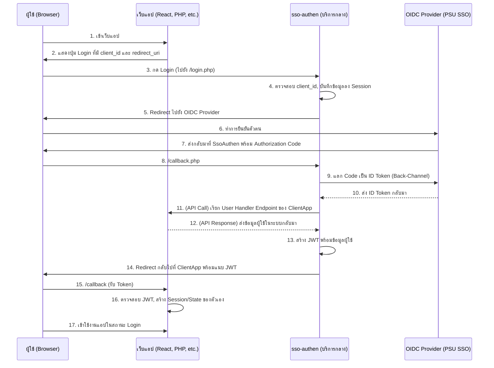

# **คู่มือการติดตั้งและใช้งาน sso-authen Service (V.3)**

`sso-authen` V.3 คือ บริการกลาง (Centralized Service) สำหรับการยืนยันตัวตนด้วยมาตรฐาน OpenID Connect (OIDC) ที่ถูกออกแบบมาเพื่อทำหน้าที่เป็น Single Sign-On Gateway ให้กับทุกเว็บแอปพลิเคชันในองค์กรของคุณ

สถาปัตยกรรม V.3 ได้รับการยกเครื่องใหม่ทั้งหมดให้เป็น Stateless Authentication Service ที่ทันสมัย, ยืดหยุ่น, และปลอดภัยสูง สามารถรองรับแอปพลิเคชันที่หลากหลาย (Multi-Client) ไม่ว่าจะเป็น PHP, Node.js, React, Vue, หรือเทคโนโลยีอื่นๆ ได้อย่างสมบูรณ์

---

## ✨ คุณสมบัติ (Key Features)

* **Centralized Service:** ติดตั้งครั้งเดียวในโดเมนกลาง (เช่น auth.your-org.com) และให้บริการยืนยันตัวตนกับทุกแอปในองค์กร ช่วยให้บำรุงรักษาง่ายและมีมาตรฐานเดียวกัน
* **Multi-Client Architecture:** กระบวนการทั้งหมดจบลงด้วยการส่งมอบ JSON Web Token (JWT) ที่มีการลงลายเซ็นดิจิทัล ทำให้สถาปัตยกรรมฝั่ง Client App เป็นแบบ Stateless และทันสมัย
* **Technology Agnostic:** แอปพลิเคชันที่มาเชื่อมต่อไม่จำเป็นต้องเขียนด้วย PHP ขอเพียงแค่สามารถจัดการ HTTP Redirect และ JWT ได้เท่านั้น
* **Backward Compatibility:** ยังคงรองรับแอปพลิเคชัน PHP รุ่นเก่าที่ต้องการให้ sso-authen สร้าง Session ให้โดยตรง (Legacy Mode) ผ่านการตั้งค่า
* **Multi-Provider Support:** รองรับการเชื่อมต่อกับผู้ให้บริการ OIDC หลายรายผ่านระบบคอนฟิกที่ยืดหยุ่น
* **Data Normalization:** มีระบบแปลงข้อมูล (Claim Mapping) เพื่อให้แอปพลิเคชันได้รับข้อมูลผู้ใช้ในรูปแบบมาตรฐานเดียวกันเสมอ ไม่ว่าจะล็อกอินมาจากที่ใด
* **Flexible & Decoupled:** แยกหน้าที่ของ "ผู้ยืนยันตัวตน (Authentication)" ออกจาก "ผู้อนุญาตสิทธิ์ (Authorization)" ของแต่ละแอปอย่างชัดเจนผ่าน API Contract**
* **User-Friendly Feedback:** มีระบบแสดงผลข้อความโต้ตอบที่สวยงามด้วย SweetAlert2

---

## 📋 ข้อกำหนด (Requirements)

* **สำหรับ `sso-authen` Service:**
    * Web Server ที่รัน PHP 7.0+ ได้ (เช่น Apache, Nginx)
    * Composer
    * PHP Extensions: cURL, JSON, OpenSSL
    * Credentials (Client ID และ Client Secret) จาก OIDC Provider (เช่น PSU SSO, Google)
* **สำหรับเว็บแอปพลิเคชันของคุณ:**
    * ความสามารถในการสร้างลิงก์ HTTP ที่มี Query String
    * ความสามารถในการสร้างหน้า Callback เพื่อรับพารามิเตอร์จาก URL
    * (สำหรับ JWT Mode) Library สำหรับถอดรหัสและตรวจสอบ JWT
    * (แนะนำ) ความสามารถในการสร้าง API Endpoint เพื่อจัดการข้อมูลผู้ใช้ของตัวเอง

---

## 📁 โครงสร้างไฟล์ (Files Structure)

โปรเจกต์ sso-authen ถูกออกแบบมาให้ทำงานเป็นบริการที่สมบูรณ์ในตัวเอง (Self-contained Service) โดยมีโครงสร้างดังนี้:

```text
/sso-authen/                    <-- โฟลเดอร์หลักของบริการ
|
|-- config/                     <-- เก็บไฟล์ตั้งค่าทั้งหมด
|   |-- config.php              (ไฟล์ตั้งค่าหลัก, ลงทะเบียน Clients)
|   `-- providers/
|       `-- psu.php             (ตัวอย่างการตั้งค่า OIDC Provider)
|
|-- public/                     <-- Endpoints ที่เข้าถึงได้จากภายนอก
|   |-- callback.php
|   |-- login.php
|   |-- logout.php
|   |-- helpers.php
|   `-- templates/
|       `-- layout.php
|
|-- src/                        <-- Core Logic ของบริการ
|   `-- SsoHandler.php
|
|-- examples/                   <-- (แนะนำ) โค้ดตัวอย่างสำหรับ Client App
|   |-- js-client/              (ตัวอย่างแอป Vanilla JS + Node.js)
|   `-- php-client/             (ตัวอย่างแอป PHP)
|
|-- vendor/                     (สร้างโดย Composer)
`-- composer.json
```
---

## ⚙️ หลักการทำงาน (How it Works)

`sso-authen` ทำหน้าที่เป็น "สำนักงานออกหนังสือเดินทางกลาง" เมื่อแอปพลิเคชันต่างๆ ต้องการยืนยันตัวตนผู้ใช้ จะส่งผู้ใช้มาที่นี่เพื่อทำกระบวนการทั้งหมด และรับกลับไปเพียง "หนังสือเดินทาง (JWT)" ที่ประทับตราเรียบร้อยแล้ว

**แผนภาพการทำงาน:**



---

## 🚀 การติดตั้งและตั้งค่า (Installation & Configuration)

### 1. ติดตั้งบริการกลาง

ติดตั้ง sso-authen บน Server หรือ Subdomain ของตัวเอง (เช่น https://auth.your-org.com) จากนั้นใน Terminal ให้เข้าไปที่ไดเรกทอรีแล้วรันคำสั่ง:

```bash
composer install
```

### 2. ตั้งค่า `config.php`

เปิดไฟล์ `sso-authen/config/config.php` และกำหนดค่า 3 ส่วนหลัก:

2.1 ลงทะเบียนแอปพลิเคชันที่จะมาเชื่อมต่อ (Authorized Clients)
นี่คือหัวใจของ V.3 ใช้สำหรับลงทะเบียนแอปพลิเคชันทั้งหมดที่ได้รับอนุญาตให้ใช้บริการ SSO นี้

```php
// sso-authen/config/config.php

$authorized_clients = [
    // ตัวอย่างสำหรับ React/JS App
    'my_react_app' => [
        'app_redirect_uri'         => 'http://localhost:3000/auth/callback',
        'post_logout_redirect_uri' => 'http://localhost:3000/logout-success',
        'user_handler_endpoint'    => 'http://localhost:8080/api/sso-user-handler',
        'api_secret_key'           => 'SECRET_KEY_FOR_REACT_APP'
    ],
    // ตัวอย่างสำหรับ PHP App ที่ใช้ JWT
    'my_php_app' => [
        'app_redirect_uri'         => '[http://my-php-app.test/sso_callback.php](http://my-php-app.test/sso_callback.php)',
        'post_logout_redirect_uri' => '[http://my-php-app.test/index.php](http://my-php-app.test/index.php)',
        'user_handler_endpoint'    => '[http://my-php-app.test/api/user_handler.php](http://my-php-app.test/api/user_handler.php)',
        'api_secret_key'           => 'ANOTHER_SECRET_KEY_FOR_PHP_APP'
    ],
    // ตัวอย่างสำหรับ Legacy PHP App ที่ต้องการให้สร้าง Session ให้ (Backward Compatibility)
    'legacy_app' => [
        'app_redirect_uri'         => '[http://legacy-app.test/index.php](http://legacy-app.test/index.php)',
        'post_logout_redirect_uri' => '[http://legacy-app.test/index.php](http://legacy-app.test/index.php)',
        'user_handler_endpoint'    => null, // ตั้งเป็น null เพื่อเข้าสู่ Legacy Mode
        'api_secret_key'           => null
    ]
];
```

2.2 ตั้งค่า JWT
กำหนด Secret Key ที่จะใช้ "ลงลายเซ็น" ใน JWT ทุกใบที่บริการนี้ออกให้

```php
// sso-authen/config/config.php

define('JWT_SECRET_KEY', 'YOUR_SUPER_SECRET_KEY_FOR_JWT_GENERATION_THAT_IS_VERY_LONG');
define('JWT_EXPIRATION', 3600); // อายุของ Token (วินาที)
```

2.3 เพิ่ม Provider ใหม่ (ถ้าจำเป็น)

หากต้องการเชื่อมต่อกับผู้ให้บริการรายใหม่ (เช่น มหาวิทยาลัยอื่น) ให้สร้างไฟล์คอนฟิกสำหรับผู้ให้บริการแต่ละรายใน `sso-authen/config/providers/` โดยใช้ psu.php เป็นต้นแบบ และแก้ไขค่า `clientID`, `clientSecret`, `providerURL`, `redirectUri`, `scopes`, และ `claim_mapping` ให้ถูกต้อง 

ตัวอย่าง **psu.php**:

```php
<?php
// sso-authen/config/providers/psu.php
return [
    'clientID'     => 'YOUR_PSU_CLIENT_ID_HERE',
    'clientSecret' => 'YOUR_PSU_CLIENT_SECRET_HERE',
    'providerURL'  => '[https://psusso.psu.ac.th/](https://psusso.psu.ac.th/)...',
    'redirectUri'  => '[http://your-app.test/sso-authen/public/callback.php](http://your-app.test/sso-authen/public/callback.php)', 
    'scopes'       => ['openid', 'profile', 'email', 'psu_profile'],
    'claim_mapping' => [
        'id'        => 'psu_id',
        'username'  => 'preferred_username',
        'name'      => 'display_name_th',
        'email'     => 'email',
        // ... map fields as needed ...
    ]
];
```

---

## 🔌 คู่มือการเชื่อมต่อสำหรับเว็บแอปพลิเคชัน (Client Integration Guide)

นี่คือ "กติกา" สำหรับนักพัฒนาที่ต้องการนำแอปพลิเคชันของตนมาเชื่อมต่อกับ `sso-authen` กลาง

### 1. ลงทะเบียนแอปพลิเคชัน

ติดต่อผู้ดูแลระบบของ sso-authen เพื่อขอ client_id และลงทะเบียนข้อมูลต่างๆ ของแอปคุณในไฟล์ config.php กลาง

### 2. สร้างลิงก์ Login และ Logout
ในแอปพลิเคชันของคุณ ให้สร้างลิงก์ไปยัง sso-authen Service ให้ถูกต้องตามรูปแบบ

* Login Link: ต้องมี client_id และ redirect_uri

```html
<a href="[https://auth.your-org.com/public/login.php?client_id=my_react_app&redirect_uri=http://localhost:3000/auth/callback](https://auth.your-org.com/public/login.php?client_id=my_react_app&redirect_uri=http://localhost:3000/auth/callback)">
    Login
</a>
```

* Logout Link: ต้องมี post_logout_redirect_uri

```html
<a href="[https://auth.your-org.com/public/logout.php?post_logout_redirect_uri=http://localhost:3000/logout-success](https://auth.your-org.com/public/logout.php?post_logout_redirect_uri=http://localhost:3000/logout-success)">
    Logout
</a>
```

### 3. สร้าง API Endpoint สำหรับจัดการผู้ใช้

สร้าง API Endpoint ในแอปของคุณตาม API Contract (ดูเพิ่มเติมใน examples) เพื่อจัดการข้อมูลผู้ใช้ในฐานข้อมูลของแอปคุณเอง Endpoint นี้ต้องตรวจสอบ X-API-SECRET Header ที่ตรงกับ 'api_secret_key' ที่คุณลงทะเบียนไว้

### 4: สร้างหน้า Callback เพื่อรับ JWT
นี่คือขั้นตอนที่สำคัญที่สุดฝั่ง Client App คุณต้องสร้างหน้าที่ redirect_uri ชี้มา เพื่อรับ Token ที่ sso-authen ส่งกลับมา

ตัวอย่าง Callback สำหรับแอป PHP (sso_callback.php):

```php
<?php
require 'vendor/autoload.php';
use Firebase\JWT\JWT;
use Firebase\JWT\Key;

// Secret Key นี้ต้องตรงกับ JWT_SECRET_KEY ของ sso-authen
const JWT_SHARED_SECRET_KEY = 'YOUR_SUPER_SECRET_KEY_...'; 

session_start();
$jwt = $_GET['token'] ?? null;

try {
    $decoded = JWT::decode($jwt, new Key(JWT_SHARED_SECRET_KEY, 'HS256'));
    $userInfo = (array) $decoded->data;
    
    // สร้าง Session ของตัวเอง
    $_SESSION['user_is_logged_in'] = true;
    $_SESSION['user_info'] = $userInfo;

    header('Location: index.php');
    exit;
} catch (\Exception $e) {
    die('Authentication Failed: ' . $e->getMessage());
}
```

ตัวอย่าง Callback สำหรับแอป JavaScript (app.js):

```JS
// ในหน้า callback.html
const params = new URLSearchParams(window.location.search);
const token = params.get('token');

if (token) {
    localStorage.setItem('jwt_token', token); // เก็บ Token
    window.location.href = '/index.html';    // กลับไปหน้าหลัก
}
```

ขั้นตอนที่ 5: ป้องกันหน้าเพจและเรียกใช้ API
สำหรับแอป PHP: ใช้ $_SESSION ที่สร้างขึ้นในหน้า Callback เพื่อตรวจสอบการล็อกอิน
สำหรับแอป JS: นำ jwt_token ที่เก็บไว้ใน localStorage มาแนบกับ Authorization Header ในทุกๆ Request ที่ส่งไปยัง Backend ของคุณ

```JS
Authorization: Bearer <your_jwt_token>
```

---

## 📜 API Contract (User Handler Endpoint)

นี่คือข้อกำหนดของข้อมูลที่ `sso-authen` และเว็บแอปพลิเคชันของคุณใช้สื่อสารกัน

### Request: `sso-authen` → Web App

* **Method:** `POST`
* **Headers:**
    * `Content-Type: application/json`
    * `X-API-SECRET: {your_app_api_secret_key}`
* **Request Body (JSON):**

```json
{
  "normalizedUser": {
    "id": "user123",
    "username": "test.user",
    "name": "Test User",
    "firstName": "Test",
    "lastName": "User",
    "email": "test.u@example.com",
    "department": "IT Department"
  },
  "ssoUserInfo": {
    "sub": "user123",
    "preferred_username": "test.user",
    "name": "Test User",
    "email": "test.u@example.com",
    "...": "..."
  }
}
```

### Response: Web App → `sso-authen`

* **Status Code:** `200 OK`
* **Response Body (JSON):**

```json
{
  "id": 123,
  "user_id": "user123",
  "email": "test.u@example.com",
  "name": "Test User",
  "role": "admin"
}
```

---

## 🔌 การตั้งค่าอื่น ๆ

### 1. ตั้งค่าการเชื่อมต่อฐานข้อมูล (สำหรับเว็บแอปพลิเคชัน ถ้ายังไม่มี)

สร้างไฟล์ `db_config.php` ใน root ของเว็บแอปพลิเคชัน เพื่อเก็บข้อมูลการเชื่อมต่อฐานข้อมูล

```php
<?php // db_config.php
define('DB_HOST', 'localhost');
define('DB_NAME', 'your_database_name');
define('DB_USER', 'root');
define('DB_PASS', '');
define('DB_CHARSET', 'utf8mb4');
```

### 2. สร้างตารางสมาชิก (สำหรับแอปพลิเคชัน ถ้ายังไม่มี)

รันคำสั่ง SQL นี้ในฐานข้อมูลของแอปพลิเคชันเพื่อสร้างตาราง `users`

```sql
CREATE TABLE `users` (
  `id` int(11) NOT NULL AUTO_INCREMENT,
  `user_id` varchar(255) DEFAULT NULL,
  `email` varchar(255) NOT NULL,
  `name` varchar(255) NOT NULL,
  `role` varchar(50) NOT NULL DEFAULT 'subscriber',
  `created_at` timestamp NOT NULL DEFAULT current_timestamp(),
  `updated_at` timestamp NOT NULL DEFAULT current_timestamp() ON UPDATE current_timestamp(),
  PRIMARY KEY (`id`),
  UNIQUE KEY `email` (`email`)
) ENGINE=InnoDB DEFAULT CHARSET=utf8mb4;
```

### 3. สร้างไฟล์จัดการผู้ใช้ของเว็บแอปใน Legacy Mode (user_handler.php)

ในโปรเจกต์หลักของคุณ (your-webapp) สร้างไฟล์ `user_handler.php` ที่มีฟังก์ชัน `findOrCreateUser()` เพื่อค้นหาหรือสร้างผู้ใช้ตามข้อมูลที่ได้รับจาก SSO เพื่อจัดการกับฐานข้อมูลสมาชิกของแอปพลิเคชันคุณเอง

```php
<?php
/**
 * www/user_handler.php
 * เทมเพลตสำหรับจัดการข้อมูลผู้ใช้ในฐานข้อมูลของแอปพลิเคชัน
 * นี่คือไฟล์ "สัญญาใจ" ที่แต่ละแอปพลิเคชันต้องสร้างขึ้นเอง
 */

/**
 * ค้นหาผู้ใช้จากฐานข้อมูลด้วยข้อมูลจาก SSO หากไม่พบจะสร้างผู้ใช้ใหม่
 *
 * @param array $normalizedUser ข้อมูลผู้ใช้ที่ผ่านการแปลงชื่อฟิลด์เป็นมาตรฐานแล้ว
 * @param object $ssoUserInfo ข้อมูลผู้ใช้ดิบที่ได้จาก Provider SSO
 * @return array ข้อมูลผู้ใช้จากฐานข้อมูลภายในของแอปพลิเคชัน (รวม role)
 */
function findOrCreateUser(array $normalizedUser, object $ssoUserInfo): array {
    // 1. เรียกใช้ไฟล์ตั้งค่าฐานข้อมูล
    require_once __DIR__ . '/db_config.php';

    // 2. ตั้งค่าการเชื่อมต่อ PDO
    $dsn = "mysql:host=" . DB_HOST . ";dbname=" . DB_NAME . ";charset=" . DB_CHARSET;
    $options = [
        PDO::ATTR_ERRMODE            => PDO::ERRMODE_EXCEPTION,
        PDO::ATTR_DEFAULT_FETCH_MODE => PDO::FETCH_ASSOC,
        PDO::ATTR_EMULATE_PREPARES   => false,
    ];

    try {
        // 3. เชื่อมต่อฐานข้อมูล
        $pdo = new PDO($dsn, DB_USER, DB_PASS, $options);

        // 4. ค้นหาผู้ใช้จากอีเมล (หรือ user_id ถ้าต้องการ)
        $stmt = $pdo->prepare("SELECT * FROM users WHERE email = ?");
        $stmt->execute([$normalizedUser['email']]);
        $user = $stmt->fetch();

        if ($user) {
            // --- กรณีที่ 1: พบผู้ใช้ในระบบ (สมาชิกเก่า) ---

            // อัปเดตข้อมูลล่าสุด (เผื่อมีการเปลี่ยนชื่อ-สกุล)
            $updateStmt = $pdo->prepare(
                "UPDATE users SET name = ?, user_id = ? WHERE id = ?"
            );
            $updateStmt->execute([
                $normalizedUser['name'],
                $normalizedUser['id'], // user_id
                $user['id']
            ]);
            
            // คืนค่าข้อมูลผู้ใช้จากฐานข้อมูลของเรา
            return $user;

        } else {
            // --- กรณีที่ 2: ไม่พบผู้ใช้ในระบบ (สมาชิกใหม่) ---

            // กำหนด Role เริ่มต้น
            $defaultRole = 'subscriber';

            // เตรียมข้อมูลและสร้างผู้ใช้ใหม่
            $insertStmt = $pdo->prepare(
                "INSERT INTO users (user_id, email, name, role) VALUES (?, ?, ?, ?)"
            );
            $insertStmt->execute([
                $normalizedUser['id'], // user_id
                $normalizedUser['email'],
                $normalizedUser['name'],
                $defaultRole
            ]);

            $newUserId = $pdo->lastInsertId();

            // คืนค่าข้อมูลผู้ใช้ใหม่ที่เพิ่งสร้าง
            return [
                'id' => $newUserId,
                'user_id' => $normalizedUser['id'],
                'email' => $normalizedUser['email'],
                'name' => $normalizedUser['name'],
                'role' => $defaultRole
            ];
        }

    } catch (\PDOException $e) {
        // หากมีปัญหาในการเชื่อมต่อหรือคิวรีฐานข้อมูล ให้หยุดการทำงานและแสดงข้อผิดพลาด
        // ในระบบจริง ควรจะบันทึก Log แทนการ die()
        throw new \PDOException($e->getMessage(), (int)$e->getCode());
    }
}
```

### 4. การป้องกันหน้าเพจ (Auth Guard) กรณีเว็บแอป PHP

สำหรับทุกหน้าที่ต้องการการยืนยันตัวตน ให้เพิ่มโค้ด "ยามเฝ้าประตู" (Auth Guard) ไว้ที่บรรทัดบนสุดของไฟล์

ตัวอย่าง:

```php
<?php
// protected_page.php

if (!session_id()) {
    session_start();
}

// ตรวจสอบสถานะการล็อกอิน
if (!isset($_SESSION['user_is_logged_in']) || !$_SESSION['user_is_logged_in']) {
    // ถ้ายังไม่ได้ล็อกอิน ให้ส่งไปหน้า login ของไลบรารี
    header("Location: /sso-authen/public/login.php");
    exit;
}

// หากล็อกอินแล้ว สามารถดึงข้อมูลผู้ใช้จาก Session มาใช้งานได้
$currentUser = $_SESSION['user_info'];
echo "ยินดีต้อนรับ, " . htmlspecialchars($currentUser['name']);
```

---

### 💡 บันทึกทางเทคนิค (Technical Notes)
สำหรับนักพัฒนาที่ต้องการทำความเข้าใจสถาปัตยกรรมเบื้องหลังของ sso-authen V.3

* Stateless JWT Flow: หัวใจของ V.3 คือการเปลี่ยนจากการใช้ PHP Session ในการจัดการสถานะล็อกอิน มาเป็นการออก JWT ที่มีการลงลายเซ็น ทำให้บริการเป็นแบบ Stateless และสามารถให้บริการกับ Client ที่หลากหลายได้โดยไม่จำเป็นต้องแชร์สถานะร่วมกัน
* Dynamic Client Configuration: sso-authen ใช้ PHP Session เป็นเพียง "ตัวกลางชั่วคราว" ในการส่งต่อ client_id จาก login.php ไปยัง callback.php เท่านั้น เมื่อ callback.php ทำงาน มันจะใช้ client_id ที่เก็บไว้ใน Session เพื่อดึงการตั้งค่าที่ถูกต้องของแอปนั้นๆ (เช่น user_handler_endpoint, api_secret_key) จาก $authorized_clients มาใช้งานแบบไดนามิก
* API Contract is Key: การแยกหน้าที่ระหว่าง "Authentication" (โดย sso-authen) และ "Authorization" (โดย Client App) เกิดขึ้นผ่าน user_handler_endpoint การที่ Client App จัดการฐานข้อมูลผู้ใช้และกำหนดสิทธิ์ (role) ของตัวเอง ทำให้ sso-authen ไม่ต้องยุ่งเกี่ยวกับตรรกะภายในของแต่ละแอปเลย
* Backward Compatibility: การตั้งค่า user_handler_endpoint เป็น null สำหรับ Client ใดๆ ใน config.php จะทำให้ SsoHandler สลับไปทำงานใน "Legacy Mode" โดยจะเรียกใช้ findOrCreateUser() จากไฟล์ user_handler.php และสร้าง $_SESSION โดยตรง เหมาะสำหรับแอปพลิเคชัน PHP รุ่นเก่าที่ไม่ต้องการปรับปรุงเป็น JWT Flow
* Security:
** Redirect URI Validation: login.php จะตรวจสอบ redirect_uri ที่ Client ส่งมากับค่าที่ลงทะเบียนไว้ใน config.php ทุกครั้ง เพื่อป้องกันการโจมตีแบบ Open Redirect
** State Parameter: ไลบรารี jumbojett/openid-connect-php ที่ใช้ภายในมีการจัดการ state parameter โดยอัตโนมัติ เพื่อป้องกันการโจมตีแบบ CSRF ระหว่างการ Redirect
