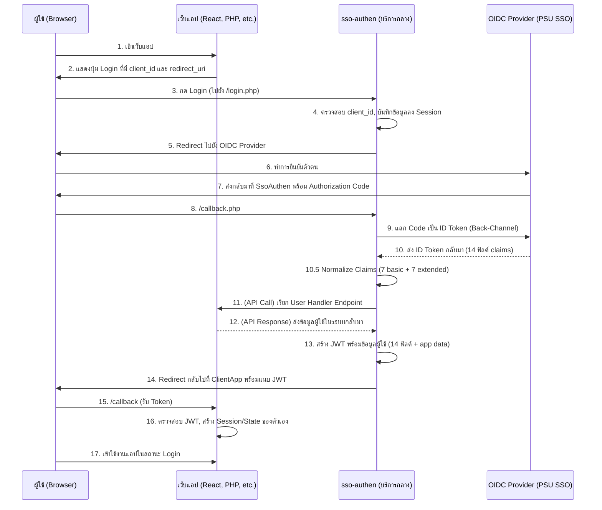

# **คู่มือการติดตั้งและใช้งาน sso-authen Service (V.3.1)**

`sso-authen` V.3.1 คือ บริการกลาง (Centralized Service) สำหรับการยืนยันตัวตนด้วยมาตรฐาน OpenID Connect (OIDC) ที่ถูกออกแบบมาเพื่อทำหน้าที่เป็น Single Sign-On Gateway ให้กับทุกเว็บแอปพลิเคชันในองค์กรของคุณ

สถาปัตยกรรม V.3.1 ได้รับการปรับปรุงให้เป็น Stateless Authentication Service ที่ทันสมัย, ยืดหยุ่น, และปลอดภัยสูง สามารถรองรับแอปพลิเคชันที่หลากหลาย (Multi-Client) ไม่ว่าจะเป็น PHP, Node.js, React, Vue, หรือเทคโนโลยีอื่นๆ ได้อย่างสมบูรณ์

---

## ✨ คุณสมบัติ (Key Features)

* **Centralized Service:** ติดตั้งครั้งเดียวในโดเมนกลาง (เช่น auth.your-org.com) และให้บริการยืนยันตัวตนกับทุกแอปในองค์กร ช่วยให้บำรุงรักษาง่ายและมีมาตรฐานเดียวกัน
* **Multi-Client Architecture:** กระบวนการทั้งหมดจบลงด้วยการส่งมอบ JSON Web Token (JWT) ที่มีการลงลายเซ็นดิจิทัล ทำให้สถาปัตยกรรมฝั่ง Client App เป็นแบบ Stateless และทันสมัย
* **Technology Agnostic:** แอปพลิเคชันที่มาเชื่อมต่อไม่จำเป็นต้องเขียนด้วย PHP ขอเพียงแค่สามารถจัดการ HTTP Redirect และ JWT ได้เท่านั้น
* **Backward Compatibility:** ยังคงรองรับแอปพลิเคชัน PHP รุ่นเก่าที่ต้องการให้ sso-authen สร้าง Session ให้โดยตรง (Legacy Mode) ผ่านการตั้งค่า
* **Multi-Provider Support:** รองรับการเชื่อมต่อกับผู้ให้บริการ OIDC หลายรายผ่านระบบคอนฟิกที่ยืดหยุ่น
* **Data Normalization:** มีระบบแปลงข้อมูล (Claim Mapping) เพื่อให้แอปพลิเคชันได้รับข้อมูลผู้ใช้ในรูปแบบมาตรฐานเดียวกันเสมอ ไม่ว่าจะล็อกอินมาจากที่ใด
* **Flexible & Decoupled:** แยกหน้าที่ของ "ผู้ยืนยันตัวตน (Authentication)" ออกจาก "ผู้อนุญาตสิทธิ์ (Authorization)" ของแต่ละแอปอย่างชัดเจนผ่าน API Contract**
* **User-Friendly Feedback:** มีระบบแสดงผลข้อความโต้ตอบที่สวยงามด้วย SweetAlert2
* **Admin Panel:** ระบบจัดการผู้ดูแลที่ทันสมัยพร้อมแดชบอร์ดแบบเรียลไทม์, การจัดการ Client Applications แบบครบวงจร, และระบบสถิติการใช้งาน
* **Enhanced Security:** ระบบบันทึกกิจกรรม (Audit Logs), การจัดการ JWT Secret, และการตรวจสอบความปลอดภัยแบบครบวงจร
* **Extended Claims Support:** รองรับข้อมูลผู้ใช้เพิ่มเติมจาก PSU SSO รวม 14 ฟิลด์ (7 basic + 7 extended) สำหรับการกำหนดสิทธิ์ที่ละเอียด
* **OAuth Scope Management:** ระบบจัดการ OAuth Scopes ที่สอดคล้องกับข้อกำหนดของ PSU SSO โดยอัตโนมัติ

---

## 📋 ข้อกำหนด (Requirements)

* **สำหรับ `sso-authen` Service:**
    * Web Server ที่รัน PHP 7.4.33 ได้ (เช่น Apache, Nginx)
    * Composer
    * PHP Extensions: cURL, JSON, OpenSSL, PDO MySQL
    * Credentials (Client ID และ Client Secret) จาก OIDC Provider (เช่น PSU SSO, Google)
    * MySQL 5.7+ หรือ MariaDB 10.2+ สำหรับฐานข้อมูล
* **สำหรับเว็บแอปพลิเคชันของคุณ:**
    * ความสามารถในการสร้างลิงก์ HTTP ที่มี Query String
    * ความสามารถในการสร้างหน้า Callback เพื่อรับพารามิเตอร์จาก URL
    * (สำหรับ JWT Mode) Library สำหรับถอดรหัสและตรวจสอบ JWT
    * (แนะนำ) ความสามารถในการสร้าง API Endpoint เพื่อจัดการข้อมูลผู้ใช้ของตัวเอง
* **สำหรับ Admin Panel:**
    * Web Browser ที่รองรับ Bootstrap 5 (Chrome, Firefox, Edge, Safari)
    * การเชื่อมต่อฐานข้อมูลที่ถูกต้อง
    * บัญชีผู้ดูแลระบบ (admin user) ที่ลงทะเบียนในระบบ

---

## 📁 โครงสร้างไฟล์ (Files Structure)

โปรเจกต์ sso-authen ถูกออกแบบมาให้ทำงานเป็นบริการที่สมบูรณ์ในตัวเอง (Self-contained Service) โดยมีโครงสร้างดังนี้:

```text
/sso-authen/                    <-- โฟลเดอร์หลักของบริการ
|
|-- config/                     <-- เก็บไฟล์ตั้งค่าทั้งหมด
|   |-- config.php              (ไฟล์ตั้งค่าหลัก, ลงทะเบียน Clients)
|   `-- providers/
|       |-- psu.php             (ตัวอย่างการตั้งค่า PSU SSO Provider)
|       |-- google.php          (ตัวอย่างการตั้งค่า Google Provider)
|       |-- microsoft.php       (ตัวอย่างการตั้งค่า Microsoft Provider)
|       |-- auth0.php           (ตัวอย่างการตั้งค่า Auth0 Provider)
|       `-- okta.php            (ตัวอย่างการตั้งค่า Okta Provider)
|
|-- public/                     <-- Endpoints ที่เข้าถึงได้จากภายนอก
|   |-- callback.php            (หน้ารับข้อมูลกลับจาก SSO Provider)
|   |-- login.php               (หน้าเริ่มต้นกระบวนการ Login)
|   |-- logout.php              (หน้าออกจากระบบ)
|   |-- helpers.php             (ฟังก์ชันช่วยเหลือ)
|   `-- templates/
|       `-- layout.php          (เทมเพลตพื้นฐาน)
|
|-- src/                        <-- Core Logic ของบริการ
|   `-- SsoHandler.php          (คลาสจัดการกระบวนการ OIDC)
|
|-- database/                   <-- ไฟล์ฐานข้อมูลและ Migration
|   |-- schema.sql              (โครงสร้างฐานข้อมูลหลัก)
|   |-- migrations/             (ไฟล์ Migration)
|   `-- install.php             (สคริปต์ติดตั้งฐานข้อมูล)
|
|-- admin/                      <-- Admin Panel
|   |-- config/
|   |   `-- admin_config.php    (การตั้งค่า Admin Panel)
|   |-- src/
|   |   |-- Controllers/        (Controller ของระบบ)
|   |   |-- Models/             (Model ของระบบ)
|   |   `-- Database/           (การเชื่อมต่อฐานข้อมูล)
|   |-- public/
|   |   |-- index.php           (หน้า Dashboard หลัก)
|   |   |-- auth/               (ระบบยืนยันตัวตนของ Admin)
|   |   |-- css/                (ไฟล์ CSS)
|   |   |-- js/                 (ไฟล์ JavaScript)
|   |   `-- api/                (API Endpoints)
|   |-- views/                  (เทมเพลต View)
|   `-- storage/                (เก็บไฟล์ Log, Backup)
|
|-- examples/                   <-- (แนะนำ) โค้ดตัวอย่างสำหรับ Client App
|   |-- JWT Mode/               (ตัวอย่างแอปแบบ JWT Mode)
|   `-- Legacy Mode/            (ตัวอย่างแอปแบบ Legacy Mode)
|
|-- vendor/                     (สร้างโดย Composer)
`-- composer.json
```

---

## ⚙️ หลักการทำงาน (How it Works)

`sso-authen` ทำหน้าที่เป็น "สำนักงานออกหนังสือเดินทางกลาง" เมื่อแอปพลิเคชันต่างๆ ต้องการยืนยันตัวตนผู้ใช้ จะส่งผู้ใช้มาที่นี่เพื่อทำกระบวนการทั้งหมด และรับกลับไปเพียง "หนังสือเดินทาง (JWT)" ที่ประทับตราเรียบร้อยแล้ว

**แผนภาพการทำงาน:**



---

## 🚀 การติดตั้งและตั้งค่า (Installation & Configuration)

### 1. ติดตั้งบริการหลัก

ติดตั้ง sso-authen บน Server หรือ Subdomain ของตัวเอง (เช่น https://auth.your-org.com) จากนั้นใน Terminal ให้เข้าไปที่ไดเรกทอรีแล้วรันคำสั่ง:

```bash
# ติดตั้ง dependencies สำหรับบริการหลัก
composer install
```

### 2. ติดตั้ง Admin Panel

Admin Panel มี dependencies ของตัวเองที่ต้องติดตั้งแยกต่างหาก:

```bash
# เข้าไปในไดเรกทอรี admin
cd admin

# ติดตั้ง dependencies สำหรับ Admin Panel
composer install

# กลับไปที่ไดเรกทอรีหลัก
cd ..
```

**หมายเหตุสำคัญ:** ต้องรัน `composer install` ทั้งในไดเรกทอรีหลักและในไดเรกทอรี `admin/` เพื่อให้ระบบทำงานได้อย่างถูกต้อง หากรันเฉพาะที่ไดเรกทอรีหลักจะทำให้ Admin Panel ไม่สามารถโหลดคลาสที่จำเป็นได้

### 3. ตั้งค่าฐานข้อมูล

สร้างฐานข้อมูล MySQL ใหม่:

```sql
CREATE DATABASE sso_authen CHARACTER SET utf8mb4 COLLATE utf8mb4_unicode_ci;
```

จากนั้นรันสคริปต์ติดตั้ง:

```bash
php database/install.php
```

### 4. ตั้งค่า `admin/config/admin_config.php`

เปิดไฟล์ `admin/config/admin_config.php` และกำหนดค่าการเชื่อมต่อฐานข้อมูล:

```php
'database' => [
    'host' => 'localhost',
    'port' => 3306,
    'database' => 'sso_authen',
    'username' => 'root',
    'password' => '',
    'charset' => 'utf8mb4',
],
```

### 5. ตั้งค่า `config/config.php`

เปิดไฟล์ `sso-authen/config/config.php` และกำหนดค่า Provider:

```php
// เลือกว่าจะใช้ Provider (มหาวิทยาลัย) ไหน
$activeProvider = 'psu'; // ตัวอย่าง: 'psu', 'google', 'microsoft', 'auth0', 'okta'
```

### 6. ตั้งค่า Provider Configuration

เปิดไฟล์ `config/providers/{provider}.php` และกำหนดค่า:

```php
<?php
// sso-authen/config/providers/psu.php
return [
    'clientID'     => 'YOUR_PSU_CLIENT_ID_HERE',
    'clientSecret' => 'YOUR_PSU_CLIENT_SECRET_HERE',
    'providerURL'  => 'https://psusso.psu.ac.th/...',
    'redirectUri'  => 'http://your-domain.com/public/callback.php', 
    'scopes'       => ['openid', 'profile', 'email', 'psu_profile'],
    
    // การแปลงชื่อ Claims จาก PSU SSO ให้เป็นชื่อมาตรฐาน (14 ฟิลด์)
    'claim_mapping' => [
        // Basic Claims (7 fields - Required)
        'id'           => 'psu_id',
        'username'     => 'preferred_username',
        'name'         => 'display_name_th',
        'firstName'    => 'first_name_th',
        'lastName'     => 'last_name_th',
        'email'        => 'email',
        'department'   => 'department_th',
        
        // Extended Claims (7 fields - PSU-specific)
        'position'     => 'position_th',      // ตำแหน่งงาน
        'campus'       => 'campus_th',        // วิทยาเขต
        'officeName'   => 'office_name_th',   // ชื่อสำนักงาน
        'facultyId'    => 'faculty_id',       // รหัสคณะ
        'departmentId' => 'department_id',    // รหัสภาควิชา
        'campusId'     => 'campus_id',        // รหัสวิทยาเขต
        'groups'       => 'groups'            // กลุ่มผู้ใช้ (array)
    ]
];
```

### 7. เข้าใช้งาน Admin Panel

เปิด Browser ไปที่ `http://your-domain.com/admin/public/` และล็อกอินด้วยบัญชีผู้ดูแลระบบ:

```
Email: admin@psu.ac.th
Password: (ใช้โหมด Development โดยอัตโนมัติ)
```

JWT Secret Key จะตั้งค่าผ่านเมนู **System Configuration** ใน Admin Panel

---

## 🗄️ การเตรียมฐานข้อมูลสำหรับแอปพลิเคชันของคุณ

เมื่อคุณต้องการเชื่อมต่อแอปพลิเคชันของคุณกับ `sso-authen` คุณจะต้องเตรียมฐานข้อมูลสำหรับจัดการข้อมูลผู้ใช้ภายในแอปของคุณเอง

### 1. สร้างตารางผู้ใช้ (Users Table)

ตัวอย่างโครงสร้างตารางผู้ใช้ขั้นต้น:

```sql
CREATE TABLE users (
    id INT AUTO_INCREMENT PRIMARY KEY,
    user_id VARCHAR(255) UNIQUE NOT NULL,
    email VARCHAR(255) UNIQUE NOT NULL,
    name VARCHAR(255) NOT NULL,
    first_name VARCHAR(255) NULL,
    last_name VARCHAR(255) NULL,
    role VARCHAR(50) DEFAULT 'user',
    department VARCHAR(255) NULL,
    position VARCHAR(255) NULL,
    campus VARCHAR(255) NULL,
    office_name VARCHAR(255) NULL,
    faculty_id VARCHAR(50) NULL,
    department_id VARCHAR(50) NULL,
    campus_id VARCHAR(50) NULL,
    `groups` TEXT NULL,
    created_at TIMESTAMP DEFAULT CURRENT_TIMESTAMP,
    updated_at TIMESTAMP DEFAULT CURRENT_TIMESTAMP ON UPDATE CURRENT_TIMESTAMP,
    
    INDEX idx_email (email),
    INDEX idx_user_id (user_id),
    INDEX idx_role (role)
) ENGINE=InnoDB DEFAULT CHARSET=utf8mb4 COLLATE=utf8mb4_unicode_ci;
```

### 2. สร้างตารางอื่นๆ ตามความจำเป็น

คุณอาจต้องการสร้างตารางเพิ่มเติมสำหรับแอปพลิเคชันของคุณ เช่น:
- ตาราง Roles และ Permissions (สำหรับระบบสิทธิ์ซับซ้อน)
- ตาราง Sessions (หากต้องการจัดการ Session อย่างละเอียด)
- ตาราง Logs (สำหรับบันทึกกิจกรรมของผู้ใช้)

---

## 🔧 การตั้งค่า Legacy Mode (สำหรับแอป PHP รุ่นเก่า)

สำหรับแอปพลิเคชัน PHP รุ่นเก่าที่ไม่สามารถใช้ JWT ได้ ระบบรองรับการทำงานในโหมด Legacy Mode ซึ่ง sso-authen จะสร้าง Session ให้โดยตรง

### 1. สร้างไฟล์ `user_handler.php`

ในแอปพลิเคชันของคุณ ให้สร้างไฟล์ `api/user_handler.php` ที่มีหน้าที่จัดการข้อมูลผู้ใช้:

```php
<?php
/**
 * api/user_handler.php
 * เทมเพลตสำหรับจัดการข้อมูลผู้ใช้ในฐานข้อมูลของแอปพลิเคชัน ที่แต่ละแอปพลิเคชันต้องสร้างขึ้นเอง
 */

/**
 * ค้นหาผู้ใช้จากฐานข้อมูลด้วยข้อมูลจาก SSO หากไม่พบจะสร้างผู้ใช้ใหม่
 *
 * @param array $normalizedUser ข้อมูลผู้ใช้ที่ผ่านการแปลงชื่อฟิลด์เป็นมาตรฐานแล้ว
 * @param object $ssoUserInfo ข้อมูลผู้ใช้ดิบที่ได้จาก PSU SSO
 * @return array ข้อมูลผู้ใช้จากฐานข้อมูลภายในของแอปพลิเคชัน (รวม role)
 */
function findOrCreateUser(array $normalizedUser, object $ssoUserInfo): array
{
    // 1. เรียกใช้ไฟล์ตั้งค่าฐานข้อมูล
    require_once __DIR__ . '/db_config.php';

    // 2. ตั้งค่าการเชื่อมต่อ PDO
    $dsn = "mysql:host=" . DB_HOST . ";dbname=" . DB_NAME . ";charset=" . DB_CHARSET;
    $options = [
        PDO::ATTR_ERRMODE            => PDO::ERRMODE_EXCEPTION,
        PDO::ATTR_DEFAULT_FETCH_MODE => PDO::FETCH_ASSOC,
        PDO::ATTR_EMULATE_PREPARES   => false,
    ];

    try {
        // 3. เชื่อมต่อฐานข้อมูล
        $pdo = new PDO($dsn, DB_USER, DB_PASS, $options);

        // 4. ค้นหาผู้ใช้จากอีเมล (หรือ user_id ถ้าต้องการ)
        $stmt = $pdo->prepare("SELECT * FROM users WHERE email = ?");
        $stmt->execute([$normalizedUser['email']]);
        $user = $stmt->fetch();

        if ($user) {
            // --- กรณีที่ 1: พบผู้ใช้ในระบบ (สมาชิกเก่า) ---

            // อัปเดตข้อมูลล่าสุด (เผื่อมีการเปลี่ยนชื่อ-สกุล)
            $updateStmt = $pdo->prepare("
                UPDATE users SET
                    name = ?, user_id = ?, first_name = ?, last_name = ?,
                    department = ?, position = ?, campus = ?, office_name = ?,
                    faculty_id = ?, department_id = ?, campus_id = ?, `groups` = ?
                WHERE id = ?
            ");
            $updateStmt->execute([
                $normalizedUser['name'],
                $normalizedUser['id'], // user_id
                $normalizedUser['firstName'] ?? null,
                $normalizedUser['lastName'] ?? null,
                $normalizedUser['department'] ?? null,
                $normalizedUser['position'] ?? null,
                $normalizedUser['campus'] ?? null,
                $normalizedUser['officeName'] ?? null,
                $normalizedUser['facultyId'] ?? null,
                $normalizedUser['departmentId'] ?? null,
                $normalizedUser['campusId'] ?? null,
                isset($normalizedUser['groups']) ? json_encode($normalizedUser['groups']) : null,
                $user['id']
            ]);

            // คืนค่าข้อมูลผู้ใช้จากฐานข้อมูลของเรา
            return $user;

        } else {
            // --- กรณีที่ 2: ไม่พบผู้ใช้ในระบบ (สมาชิกใหม่) ---

            // กำหนด Role เริ่มต้น
            $defaultRole = 'user';

            // เตรียมข้อมูลและสร้างผู้ใช้ใหม่
            $insertStmt = $pdo->prepare("
                INSERT INTO users (
                    user_id, email, name, first_name, last_name, role,
                    department, position, campus, office_name,
                    faculty_id, department_id, campus_id, `groups`
                ) VALUES (?, ?, ?, ?, ?, ?, ?, ?, ?, ?, ?, ?, ?, ?)
            ");
            $insertStmt->execute([
                $normalizedUser['id'], // user_id
                $normalizedUser['email'],
                $normalizedUser['name'],
                $normalizedUser['firstName'] ?? null,
                $normalizedUser['lastName'] ?? null,
                $defaultRole,
                $normalizedUser['department'] ?? null,
                $normalizedUser['position'] ?? null,
                $normalizedUser['campus'] ?? null,
                $normalizedUser['officeName'] ?? null,
                $normalizedUser['facultyId'] ?? null,
                $normalizedUser['departmentId'] ?? null,
                $normalizedUser['campusId'] ?? null,
                isset($normalizedUser['groups']) ? json_encode($normalizedUser['groups']) : null
            ]);

            $newUserId = $pdo->lastInsertId();

            // คืนค่าข้อมูลผู้ใช้ใหม่ที่เพิ่งสร้าง
            return [
                'id' => $newUserId,
                'user_id' => $normalizedUser['id'],
                'email' => $normalizedUser['email'],
                'name' => $normalizedUser['name'],
                'first_name' => $normalizedUser['firstName'] ?? null,
                'last_name' => $normalizedUser['lastName'] ?? null,
                'role' => $defaultRole,
                'department' => $normalizedUser['department'] ?? null,
                'position' => $normalizedUser['position'] ?? null,
                'campus' => $normalizedUser['campus'] ?? null,
                'office_name' => $normalizedUser['officeName'] ?? null,
                'faculty_id' => $normalizedUser['facultyId'] ?? null,
                'department_id' => $normalizedUser['departmentId'] ?? null,
                'campus_id' => $normalizedUser['campusId'] ?? null,
                'groups' => isset($normalizedUser['groups']) ? json_encode($normalizedUser['groups']) : null
            ];
        }

    } catch (\PDOException $e) {
        // หากมีปัญหาในการเชื่อมต่อหรือคิวรีฐานข้อมูล ให้หยุดการทำงานและแสดงข้อผิดพลาด
        // ในระบบจริง ควรจะบันทึก Log แทนการ die()
        throw new \PDOException($e->getMessage(), (int)$e->getCode());
    }
}
```

### 2. สร้างไฟล์ `db_config.php`

สร้างไฟล์ `api/db_config.php` สำหรับการตั้งค่าการเชื่อมต่อฐานข้อมูล:

```php
<?php
// api/db_config.php

define('DB_HOST', 'localhost');
define('DB_NAME', 'your_app_database'); // <-- แก้ไขชื่อฐานข้อมูลของคุณ
define('DB_USER', 'root');              // <-- User ของฐานข้อมูล
define('DB_PASS', '');                  // <-- Password ของฐานข้อมูล
define('DB_CHARSET', 'utf8mb4');
?>
```

---

## 🔌 คู่มือการเชื่อมต่อสำหรับเว็บแอปพลิเคชัน (Client Integration Guide)

นี่คือ "กติกา" สำหรับนักพัฒนาที่ต้องการนำแอปพลิเคชันของตนมาเชื่อมต่อกับ `sso-authen` กลาง

### 1. ลงทะเบียนแอปพลิเคชัน

นักพัฒนาสามารถลงทะเบียนแอปพลิเคชันของตนเองได้ด้วยตนเองผ่าน Admin Panel:

1. เข้าไปที่เมนู **Client Applications**
2. คลิกปุ่ม **Add New Client**
3. กรอกข้อมูลจำเป็น:
   - **Client Name**: ชื่อแอปพลิเคชันของคุณ
   - **Redirect URI**: URI ที่จะ redirect กลับหลังล็อกอิน
   - **Post Logout URI**: URI ที่จะ redirect กลับหลัง logout
   - **Authentication Mode**: เลือกโหมดการทำงาน
     - **JWT Mode**: ระบุ User Handler Endpoint และ API Secret Key
     - **Legacy Mode**: เว้นว่าง User Handler Endpoint
4. ระบบจะสร้าง **Client ID**, **API Secret Key** ให้อัตโนมัติ

### 2. สร้างลิงก์ Login และ Logout
ในแอปพลิเคชันของคุณ ให้สร้างลิงก์ไปยัง sso-authen Service ให้ถูกต้องตามรูปแบบ

* Login Link: ต้องมี client_id และ redirect_uri

```html
<a href="https://auth.your-org.com/public/login.php?client_id={CLIENT_ID}&redirect_uri={REDIRECT_URI}">
    Login
</a>
```

* Logout Link: ต้องมี post_logout_redirect_uri

```html
<a href="https://auth.your-org.com/public/logout.php?post_logout_redirect_uri={LOGOUT_REDIRECT_URI}">
    Logout
</a>
```

### 3. สร้าง API Endpoint สำหรับจัดการผู้ใช้ (เฉพาะ JWT Mode)

สร้าง API Endpoint ในแอปของคุณตาม API Contract เพื่อจัดการข้อมูลผู้ใช้ในฐานข้อมูลของแอปคุณเอง Endpoint นี้ต้องตรวจสอบ X-API-SECRET Header ที่ตรงกับ 'api_secret_key' ที่คุณได้รับจากการลงทะเบียน

### 4: สร้างหน้า Callback เพื่อรับ JWT
นี่คือขั้นตอนที่สำคัญที่สุดฝั่ง Client App คุณต้องสร้างหน้าที่ redirect_uri ชี้มา เพื่อรับ Token ที่ sso-authen ส่งกลับมา

ตัวอย่าง Callback สำหรับแอป PHP (sso_callback.php):

```php
<?php
require 'vendor/autoload.php';
use Firebase\JWT\JWT;
use Firebase\JWT\Key;

// Secret Key นี้ต้องตรงกับ JWT_SECRET_KEY ของ sso-authen
const JWT_SHARED_SECRET_KEY = 'YOUR_SUPER_SECRET_KEY_...'; 

session_start();
$jwt = $_GET['token'] ?? null;

try {
    $decoded = JWT::decode($jwt, new Key(JWT_SHARED_SECRET_KEY, 'HS256'));
    $userInfo = (array) $decoded->data;
    
    // สร้าง Session ของตัวเอง
    $_SESSION['user_is_logged_in'] = true;
    $_SESSION['user_info'] = $userInfo;

    header('Location: index.php');
    exit;
} catch (\Exception $e) {
    die('Authentication Failed: ' . $e->getMessage());
}
```

ตัวอย่าง Callback สำหรับแอป JavaScript (app.js):

```JS
// ในหน้า callback.html
const params = new URLSearchParams(window.location.search);
const token = params.get('token');

if (token) {
    localStorage.setItem('jwt_token', token); // เก็บ Token
    window.location.href = '/index.html';    // กลับไปหน้าหลัก
}
```

### 5: ป้องกันหน้าเพจและเรียกใช้ API
สำหรับแอป PHP: ใช้ $_SESSION ที่สร้างขึ้นในหน้า Callback เพื่อตรวจสอบการล็อกอิน
สำหรับแอป JS: นำ jwt_token ที่เก็บไว้ใน localStorage มาแนบกับ Authorization Header ในทุกๆ Request ที่ส่งไปยัง Backend ของคุณ

```JS
Authorization: Bearer <your_jwt_token>
```

---

## 🛡️ การป้องกันหน้าเพจ (Auth Guard)

### 1. สำหรับแอป PHP (Legacy Mode)

สำหรับทุกหน้าที่ต้องการการยืนยันตัวตน ให้เพิ่มโค้ด "ยามเฝ้าประตู" (Auth Guard) ไว้ที่บรรทัดบนสุดของไฟล์:

```php
<?php
// protected_page.php

if (!session_id()) {
    session_start();
}

// ตรวจสอบสถานะการล็อกอิน
if (!isset($_SESSION['user_is_logged_in']) || !$_SESSION['user_is_logged_in']) {
    // ถ้ายังไม่ได้ล็อกอิน ให้ส่งไปหน้า login ของไลบรารี
    header("Location: /sso-authen/public/login.php");
    exit;
}

// หากล็อกอินแล้ว สามารถดึงข้อมูลผู้ใช้จาก Session มาใช้งานได้
$currentUser = $_SESSION['user_info'];
echo "ยินดีต้อนรับ, " . htmlspecialchars($currentUser['name']);
```

### 2. สำหรับแอปที่ใช้ JWT Mode

สำหรับแอปที่ใช้ JWT Mode คุณต้องตรวจสอบ Token ในแต่ละ Request:

```php
<?php
// protected_api.php

require 'vendor/autoload.php';
use Firebase\JWT\JWT;
use Firebase\JWT\Key;

// ดึง Token จาก Header
$headers = getallheaders();
$authHeader = $headers['Authorization'] ?? '';
$jwt = null;

if (preg_match('/Bearer\s(\S+)/', $authHeader, $matches)) {
    $jwt = $matches[1];
}

if (!$jwt) {
    http_response_code(401);
    echo json_encode(['error' => 'Token not provided']);
    exit;
}

try {
    $decoded = JWT::decode($jwt, new Key(JWT_SHARED_SECRET_KEY, 'HS256'));
    $userInfo = (array) $decoded->data;
    
    // ใช้ข้อมูลผู้ใช้
    echo "ยินดีต้อนรับ, " . htmlspecialchars($userInfo['name']);
    
} catch (\Exception $e) {
    http_response_code(401);
    echo json_encode(['error' => 'Invalid token']);
    exit;
}
```

---

## 📜 API Contract (User Handler Endpoint)

นี่คือข้อกำหนดของข้อมูลที่ `sso-authen` และเว็บแอปพลิเคชันของคุณใช้สื่อสารกัน

### Request: `sso-authen` → Web App

* **Method:** `POST`
* **Headers:**
    * `Content-Type: application/json`
    * `X-API-SECRET: {your_app_api_secret_key}`
* **Request Body (JSON):**

```json
{
  "normalizedUser": {
    "id": "user123",
    "username": "test.user",
    "name": "Test User",
    "firstName": "Test",
    "lastName": "User",
    "email": "test.u@example.com",
    "department": "IT Department",
    "position": "Software Engineer",
    "campus": "Main Campus",
    "officeName": "IT Department",
    "facultyId": "F01",
    "departmentId": "D0101",
    "campusId": "C01",
    "groups": ["staff", "developer"]
  },
  "ssoUserInfo": {
    "sub": "user123",
    "preferred_username": "test.user",
    "name": "Test User",
    "email": "test.u@example.com",
    "...": "..."
  }
}
```

### Response: Web App → `sso-authen`

* **Status Code:** `200 OK`
* **Response Body (JSON):**

```json
{
  "id": 123,
  "user_id": "user123",
  "email": "test.u@example.com",
  "name": "Test User",
  "role": "admin"
}
```

---

## 🔌 การตั้งค่าอื่น ๆ

### 1. ตั้งค่าการเชื่อมต่อฐานข้อมูล (สำหรับเว็บแอปพลิเคชัน ถ้ายังไม่มี)

สร้างไฟล์ `db_config.php` ใน root ของเว็บแอปพลิเคชัน เพื่อเก็บข้อมูลการเชื่อมต่อฐานข้อมูล

```php
<?php // db_config.php
define('DB_HOST', 'localhost');
define('DB_NAME', 'your_app_database');
define('DB_USER', 'your_db_username');
define('DB_PASS', 'your_db_password');
define('DB_CHARSET', 'utf8mb4');
?>
```

### 2. ตั้งค่า API Secret Key (สำหรับเว็บแอปพลิเคชัน)

เมื่อลงทะเบียนแอปใน Admin Panel แล้ว ให้นำ API Secret Key ที่ได้ไปกำหนดในเว็บแอปพลิเคชันของคุณ:

```php
<?php
// app_config.php
const APP_API_SECRET_KEY = 'YOUR_GENERATED_API_SECRET_KEY';
?>
```

---

## 🛠️ แนวทางแก้ไขปัญหาที่พบบ่อย (Troubleshooting)

### ปัญหา: Admin Panel ไม่สามารถโหลดหน้าเว็บได้ หรือขึ้นข้อความ "Class not found"

**สาเหตุ:** ปัญหานี้เกิดจากการไม่ได้ติดตั้ง dependencies สำหรับ Admin Panel อย่างถูกต้อง

**วิธีแก้ไข:**

1. ตรวจสอบว่าได้รัน `composer install` ในทั้งสองไดเรกทอรีแล้ว:
   ```bash
   # ติดตั้ง dependencies สำหรับบริการหลัก
   composer install
   
   # ติดตั้ง dependencies สำหรับ Admin Panel
   cd admin
   composer install
   cd ..
   ```

2. ตรวจสอบว่าโฟลเดอร์ `vendor/` ถูกสร้างขึ้นในทั้งสองไดเรกทอรี:
   - `/vendor/` (สำหรับบริการหลัก)
   - `/admin/vendor/` (สำหรับ Admin Panel)

3. หากยังมีปัญหา ให้ลองลบทิ้งโฟลเดอร์ `vendor/` และ `composer.lock` แล้วรัน `composer install` ใหม่:
   ```bash
   # สำหรับบริการหลัก
   rm -rf vendor composer.lock
   composer install
   
   # สำหรับ Admin Panel
   cd admin
   rm -rf vendor composer.lock
   composer install
   cd ..
   ```

### ปัญหา: ไม่สามารถเชื่อมต่อฐานข้อมูลได้

**สาเหตุ:** การตั้งค่าการเชื่อมต่อฐานข้อมูลไม่ถูกต้อง

**วิธีแก้ไข:**

1. ตรวจสอบการตั้งค่าใน `config/config.php` (สำหรับบริการหลัก)
2. ตรวจสอบการตั้งค่าใน `admin/config/admin_config.php` (สำหรับ Admin Panel)
3. ตรวจสอบว่าเซิร์ฟเวอร์ฐานข้อมูลทำงานอยู่
4. ตรวจสอบว่าฐานข้อมูล `sso_authen` ถูกสร้างแล้ว

### ปัญหา: ไม่สามารถ Login ด้วย PSU SSO ได้

**สาเหตุ:** การตั้งค่า Provider ไม่ถูกต้อง หรือ Redirect URI ไม่ตรงกับที่ลงทะเบียน

**วิธีแก้ไข:**

1. ตรวจสอบการตั้งค่าใน `config/providers/psu.php`
2. ตรวจสอบว่า `redirectUri` ตรงกับที่ลงทะเบียนในระบบ PSU SSO
3. ตรวจสอบว่า URL ของเว็บแอปสามารถเข้าถึงได้จากภายนอก (ไม่ใช่ localhost)

---

## 📈 การตรวจสอบและบำรุงรักษา (Monitoring & Maintenance)

### 1. ตรวจสอบ Log Files

ระบบจะบันทึกกิจกรรมสำคัญไว้ในไฟล์ log:
- `admin/storage/logs/` - ไฟล์ log ของ Admin Panel
- ตรวจสอบ error log ของ web server สำหรับข้อผิดพลาดของระบบ

### 2. สำรองข้อมูลฐานข้อมูล

ควรตั้งค่าระบบสำรองข้อมูลฐานข้อมูลเป็นประจำ:
```bash
mysqldump -u username -p sso_authen > backup/sso_authen_backup_$(date +%Y%m%d).sql
```

### 3. อัปเดต Security Keys

ควรเปลี่ยน JWT Secret Key เป็นระยะๆ ผ่าน Admin Panel:
1. เข้าเมนู **System Configuration**
2. คลิก **Generate New Secret Key**
3. บันทึก Key ใหม่และอัปเดตในแอปพลิเคชันที่เชื่อมต่อ

---

## 📚 แหล่งข้อมูลเพิ่มเติม (Additional Resources)

* **PSU SSO Documentation:** https://psusso.psu.ac.th/docs
* **OpenID Connect Specification:** https://openid.net/connect/
* **Firebase PHP-JWT Library:** https://github.com/firebase/php-jwt
* **OIDC PHP Library:** https://github.com/jumbojett/OpenID-Connect-PHP

---

## 📞 ติดต่อสอบถาม (Contact)

หากมีข้อสงสัยหรือพบปัญหาในการติดตั้ง สามารถติดต่อได้ที่:
- Email: kittisak.k@psu.ac.th
- GitHub Issues: https://github.com/Noung/sso-authen-3/issues

---